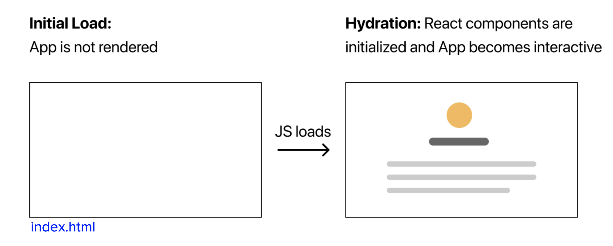
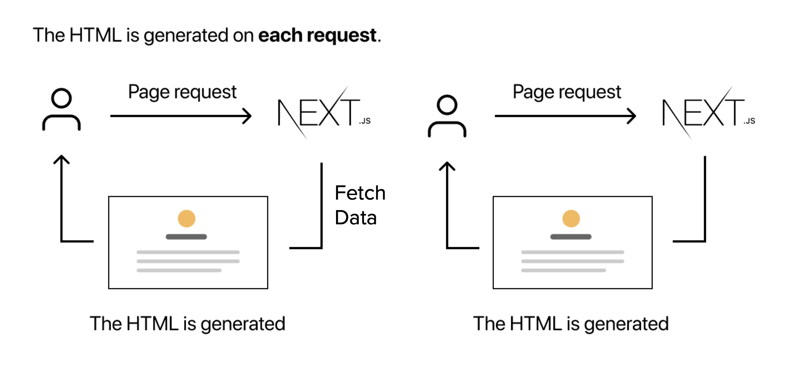
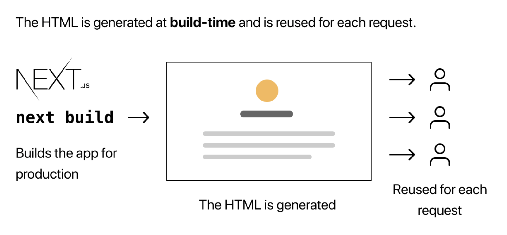
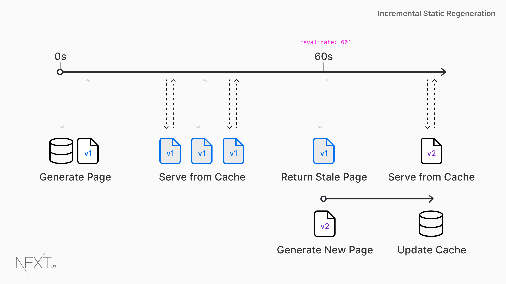

## 前言
**React** 是一個前端框架，它的特點是使用 Virtual DOM 來減少對 DOM Object 的頻繁操作，以及採用 SPA 的渲染方式。
SPA 雖然有許多優點，但它仍存在不少問題。

在這篇文章，我們一起來看看 **Next.js** 提供了怎麼樣的解決方案，來解決 Plain React Application 會遇到的問題。

## Single-Page Application (SPA)
SPA 是一種網頁的渲染方式，它的特點是從始至終都只存在一個 `.html` 的網頁 —— 無論 user 如何切換頁面。  
而 user 所看到的不同頁面，則是透過 JavaScript 切換、掛載不同的 components 來達成的效果而已。

<!--truncate-->

上圖是 SPA 的渲染過程，從 user 進入網站的那一瞬間開始，會經歷以下過程:
1. 首先會載入的是 `index.html`，裡面會有一個讓 React component 掛載 (mount) 的 DOM element。
2. 載入 JavaScript
3. JavaScript 載入完成後，會進行一個叫 `hydrate` 的動作，把 React component 掛載在 index.html 上，此時 user 才真正的看得見畫面。

以上過程可能發生在短短 0.1 秒內，也可能會花費好幾秒的時間，取決於很多因素 (網路速度、裝置效能、Data fetching 等等...)，因此會造成一些問題:
1. **SEO 不佳** - 這對需要對外公開的網頁服務相當重要，因為搜尋引擎的爬蟲程式不會等待 JavaScript 載入，因此會被解讀為一個空白網頁，造成網頁排名下降。
2. **UX 問題** - 由於網頁載入需要時間，有時候 user 會看到畫面閃爍的過程，造成不好的使用者體驗。
3. **Bundle Size** - 因為網頁需要載入大量 React 的程式來管理 Virtual DOM 的操作，因此有可能會讓 Bundle Size 過於龐大，但可以透過 code-splitting 解決問題。

這些問題的原因終究是因為把 render 的工作放在 client，讓網頁在 client 進行渲染，因此 Next.js 提供了**三種 pre-render 的方式**來決解這些問題，我們一起來看看吧！

## Server-side Rendering (SSR)
SSR 跟傳統的網頁做法一樣，render 的時機點是在 runtime，每次當 server 接收到資料時會進行一些處理，例如連線到資料庫拿資料、進行計算等...，最後把這些結果都 render 成 html，並 respond 到 client ，也就是瀏覧器上。  

這個原理跟 ASP.NET、Django 等等的**全端框架**類似，針對每個進來的 request 進行獨立的 rendering，只是 Next.js 的 SSR 還會多了 `hydrate` 這個步驟，讓網頁能夠透過寫好的 React 程式與 user 進行互動。

SSR 的優點是，因為每接收到一個 request 都會進行 render，所以 user 拿到的資料、網頁呈現的內容永遠都是最新的。
但由於把 render 的任務從 client 轉移到 server 進行，所以對 server 的負擔就會變得更高，而這也意味著我們必須架起一個 Web Server 來處理網頁的渲染。

## Static Site Generation (SSG)
SSG 的 render 時機點就跟 SSR 不一樣，它是在 build time 產生靜態的 html，然後把這些產生好的 html 直接重複使用在所有 request上。

這也意味著，我們必須在 build time 時告訴 Next.js 所有 routes & data，這樣才能在 build time 產生所有靜態檔案，並用在所有 request 上。

SSG 的優點很顯而易見，就是大幅降低 render 的次數，也就是讓 server 能在負擔最小化的情況下享有 pre-render 的好處，所以很適合一些內容不常變動的網頁，例如技術文件。但它的缺點也很明顯，就是彈性非常低，因為只要每次網頁內容需要變動時，便需要重新 build 一次專案，而且要預先準備好會產生的 routes & data，甚至如果需要 build 的內容非常龐大的話，將會浪費非常多時間在 build time。

因此，便衍生出下面的另一種 pre-render 的方式。

## Incremental Static Regeneration (ISR)
ISR 是 SSG 的進階版，它與 SSG 一樣會在 build time 預先產生靜態網頁，但不一樣的是，它會定期的在背景 rebuild，產生新的靜態網頁或者更新現有的網頁資料。

當你決定使用 ISR 的時候，你需要告訴 Next.js 一個以秒為單位的參數 —— `revalidate`，例如 `revalidate: 60`。  
如此一來，網頁便會有以下特性:
1. 每次 user 瀏覧某個特定頁面時，都會顯示 build 好的 (cached) 頁面，例如 A 版本的頁面。
2. 直到 60 秒到了，下一次進來的 request 依然會顯示 A 版本的頁面，但會在背景把頁面更新到 B 版本。
3. 更新過後，在下一個 60 秒的循環內，user 看到的就會是 B 版本的頁面，如此類推。

不僅如此，ISR 其實更像是 **SSG + SSR 的合體**。

如果 request 要求的網頁並不存在，可以選擇以下兩種做法:
1. 先以 SSR 的方式把網頁直接渲染給 user，並在背景產生靜態頁面，到下次收到同樣的 request 時就可以像 SSG 一樣重複使用。
2. 先顯示 `loading...` 的畫面，並在背景產生靜態頁面，完成後立即把內容渲染到網頁上，產生好的網頁 (cached page) 一樣能夠重複使用。

由此可見，ISR 有效的解決了 SSG 最大的缺點，也同時保有 SSG 的優勢，甚至借用了 SSR 的策略來應付不存在的網頁。
例如某電商總共有 1,000,000 個上架商品，就可以先選擇 build time 的時候只產生最熱門/熱搜的 1,000 個商品頁，其他 990,000 個商品則留到收到 request 的時候再產生 (on-demand)，這樣便能節省大量 build time 囉！

## 怎麼選擇？
看到這邊的你，是否在思考啓動一個 Next.js 專案時，該怎麼決定要使用哪一種 render 的方式呢？

請你鬆一口氣，放心吧！Next.js 提供了很大的彈性給你選擇，其實這些 pre-render 的方式都不是以 **「專案」** 為單位，而是以 **「頁面」** 為單位。換而言之，你不需要整個專案都採用 SSR、SSG 或 ISR，而是可以針對每個 page 的特性，來決定你想用哪一種 pre-render 的方式來 serve。所以，請大膽的進入 Next.js 的世界，讓它帶著你建立一個完整的網站吧！

* 如果頁面需要永遠都保持最新的話，例如 `Dashboard`、`User Profile` ...，使用 SSR。
* 如果頁面內容變動不大，很久才需要變動一次，例如 `Privacy Policy`，使用 SSG。
* 如果頁面內容變動不大，但希望會定期更新的話，例如 `Blog`、`Products`，使用ISR。

很多人在談論 Next.js 的時候都只會聯想到 SSR，但其實 Next.js 在 render 的策略上是混合式 (hybrid) 的，而它能做的事情遠比 SSR 還要更多，它甚至能讓你架 API、無痛部署你的網頁到 Vercel 上。

本篇文章完全沒有任何程式碼，就是為了以簡單的方式說明 Next.js 的三種 render 方式，希望看到這邊的大家食用愉快～